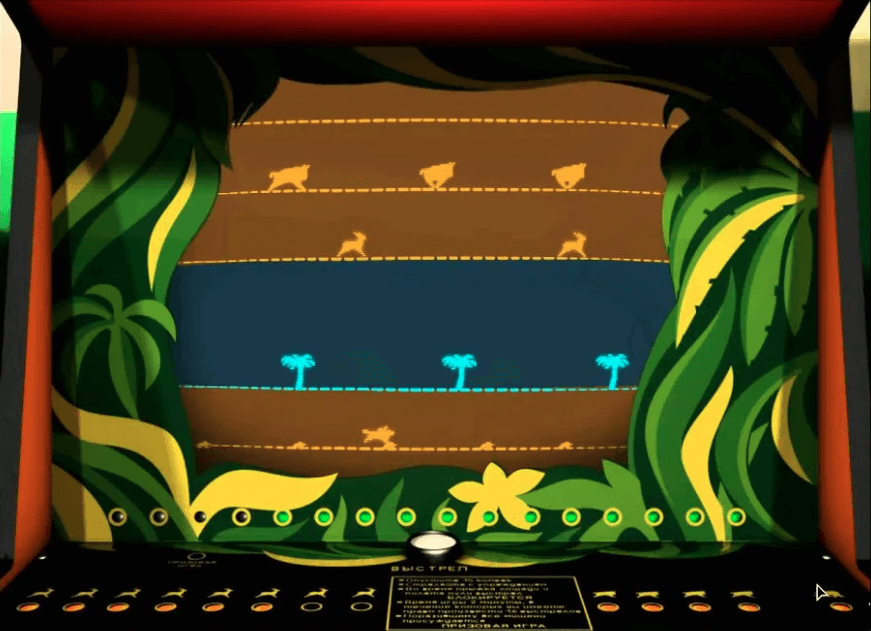

# 🎮 Советский игровой автомат "Сафари"

[](https://www.python.org/)
[](https://api.arcade.academy/)



## ✨ Особенности

Игра "Сафари" на Python с использованием игровой библиотеки Arcade.

## 📖 Описание проекта

Этот проект представляет собой воссоздание классической игры "Сафари" с советского игрового автомата. Игра была популярна в 1980-90-х годах в СССР и представляет собой охотничий симулятор с элементами аркады.

### 🎯 Механика игры
- Охотник на лошади автоматически движется по нижней дорожке
- 4 дорожки с животными появляются справа и движутся навстречу
- Игрок имеет 16 патронов для стрельбы
- Цель: поразить всех животных (8 газелей, 4 быка, 1 носорог)

### 🎮 Управление
- **ПРОБЕЛ** - старт игры / выстрел
- **ESC** - выход из игры

## 🚀 Быстрый старт

### 🛠️ Предварительные требования

- Python 3.12+
- [UV](https://github.com/astral-sh/uv)

### 📦 Управление зависимостями и установка

Проект следует современным стандартам Python:

- **`pyproject.toml`** — единый файл конфигурации проекта (стандартизирован PEP 518, 621, 660), который заменяет
  устаревшие `setup.py` и `requirements.txt`.
- **`uv.lock`** — автоматически создаваемый файл с точными версиями всех зависимостей для воспроизводимости сборки.

**Быстрая установка:**

```bash
make install # если make не установлен, тогда напрямую - uv sync
```

Файл `requirements.txt` всегда может быть сгенерирован для обратной совместимости:

```bash
uv pip compile pyproject.toml --output-file=requirements.txt
```

### 🔧 Конфигурация

Описание начальной конфигурации (к примеру заполнение .env файла)

### ▶️ Запуск приложения

```bash
# запуск игры
make run # если make не установлен, тогда напрямую - uv run python -m src.main
```

## 📁 Архитектура проекта

```text
📁 safari-arcade/
├── 📁 resources/                    # Ресурсы игры (изображения, звуки, шрифты)
│   ├── 📁 fonts/                    # Шрифты для текста в игре
│   │   ├── 📄 aventura-bold.ttf
│   │   └── 📄 safari-game-regular.ttf
│   ├── 📁 images/                   # Графические ресурсы
│   │   ├── 📁 obstacles/            # Изображения препятствий
│   │   │   ├── 📄 palm_alive.png    # Пальма (живое состояние)
│   │   │   └── 📄 palm_dead.png     # Пальма (сбитое состояние)
│   │   ├── 📁 tracks/               # Текстуры дорожек
│   │   │   ├── 📄 track_1.png       # Дорожка 1
│   │   │   ├── 📄 track_2.png       # Дорожка 2
│   │   │   ├── 📄 track_3.png       # Дорожка 3
│   │   │   ├── 📄 track_4.png       # Дорожка 4
│   │   │   └── 📄 track_5.png       # Дорожка 5
│   │   └── 📁 ui/                   # Интерфейс пользователя
│   │       ├── 📄 bg_back.png       # Фоновое изображение (задний план)
│   │       ├── 📄 bg_front.png      # Фоновое изображение (передний план)
│   │       └── 📄 slot_machine.png  # Изображение игрового автомата
│   └── 📁 sounds/                   # Звуковые эффекты
│       ├── 📄 gallop.ogg            # Звук галопа (движение)
│       └── 📄 start.ogg             # Звук начала игры
├── 📁 src/                          # Исходный код игры
│   ├── 📁 safari/                   # Основная логика игры "Сафари"
│   │   ├── 📁 entities/             # Игровые объекты (сущности)
│   │   │   ├── 📁 obstacles/        # Препятствия
│   │   │   │   ├── 📄 __init__.py   # Инициализация модуля препятствий
│   │   │   │   ├── 📄 palm.py       # Класс пальмы (препятствие)
│   │   │   │   └── 📄 palm_spawner.py # Создатель пальм (управление появлением)
│   │   │   └── 📄 track.py          # Класс дорожки (управление треками)
│   │   ├── 📁 ui/                   # Пользовательский интерфейс
│   │   │   ├── 📄 __init__.py       # Инициализация UI модуля
│   │   │   └── 📄 rules_window.py   # Окно с правилами игры
│   │   ├── 📁 views/                # Представления (игровые экраны/сцены)
│   │   │   ├── 📄 __init__.py       # Инициализация модуля представлений
│   │   │   ├── 📄 game_view.py      # Основной игровой экран
│   │   │   └── 📄 rules_view.py     # Экран с правилами
│   │   ├── 📄 __init__.py           # Инициализация модуля safari
│   │   ├── 📄 constants.py          # Константы игры (настройки, параметры)
│   │   ├── 📄 main.py               # Точка входа в игру (запуск приложения)
│   │   └── 📄 resource_manager.py   # Менеджер ресурсов (загрузка изображений, звуков)
│   └── 📄 __init__.py               # Инициализация корневого модуля src
├── 📁 tests/                        # Тесты
│   └── basic_test.py
├── .gitignore
├── .pre-commit-config.yaml
├── .python-version
├── Makefile                        # Команды для управления проектом
├── pyproject.toml                  # Конфигурация проекта
├── README.md                       # Документация проекта
└── uv.lock                         # Точные версии зависимостей
```

## 🙏 Благодарности

- **[Astral](https://astral.sh/)** — за создание невероятно быстрых и эффективных инструментов для экосистемы Python:
    - **[uv](https://github.com/astral-sh/uv)** — сверхбыстрый менеджер пакетов и инсталлятор на Rust
    - **[Ruff](https://github.com/astral-sh/ruff)** — невероятно быстрый линтер на Rust, заменивший 10+ отдельных
      инструментов
    - **[Ty](https://github.com/astral-sh/ty)** — сверхбыстрый тайп-чекер и языковой сервер на Rust

---

**Примечание:** Этот проект находится в активной разработке. Функционал и API могут меняться.
Мы приветствуем вклады сообщества через Issues и Pull Requests!
